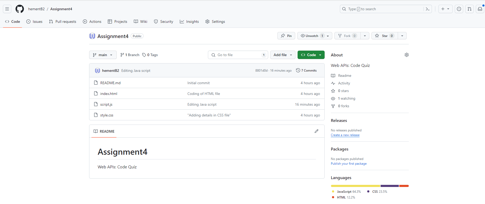
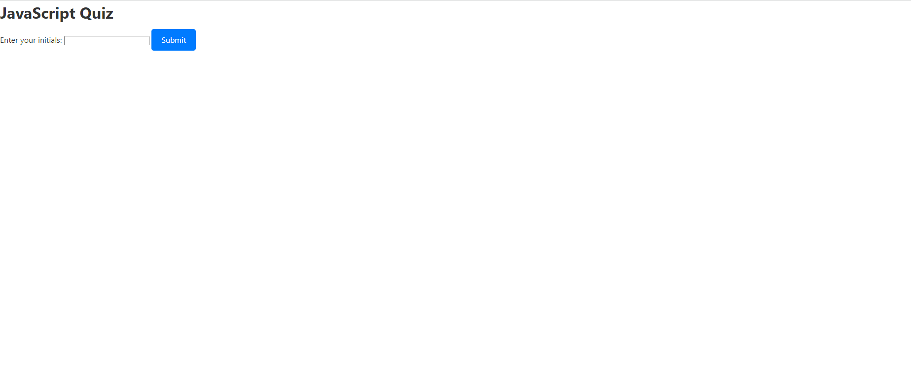

# Assignment4
Web APIs: Code Quiz

This project is a timed coding quiz with multiple-choice questions designed to test your knowledge of JavaScript fundamentals. It features a clean and responsive user interface and allows users to save their high scores.

# Table of Contents
> Installation
> Usage
> Quiz Settings
> Technical Details

# Installation
No specific installation is required for this project. Simply open the index.html file in your web browser.

# Usage
Click the "Start Quiz" button to begin the quiz.
Answer the presented questions within the given time frame.
Receive feedback on each answer.
Save your initials and score at the end of the quiz.

# Quiz Settings
The quiz is configured with the following settings:

Duration: 75 seconds
Penalty for incorrect answers: 10 seconds
Questions
What does CSS stand for?

Computer Style Sheets
Creative Style Sheets
Cascading Style Sheets
Colorful Style Sheets

# Technical Details
The project is built using HTML, CSS, and JavaScript. It dynamically updates the HTML and CSS based on user interactions.

HTML Structure
index.html: Defines the structure of the quiz, including questions, choices, and submission form.
CSS Styles
style.css: Provides global styles for the entire project and specific styles for the quiz.
JavaScript Logic
script.js: Implements the quiz functionality, including starting, displaying questions, checking answers, and ending the quiz.

# Screenshot for repository

Screenshot for the Javascript quiz

